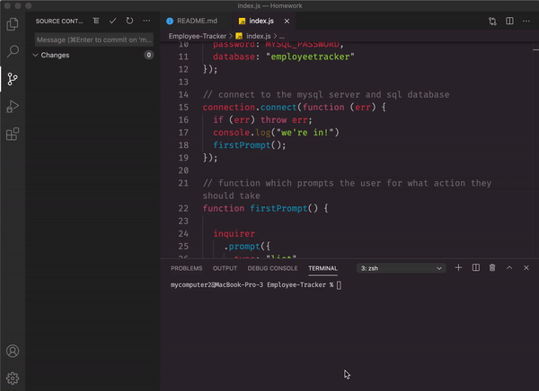

  # Loreina Salalila - Note Taker
  
  ## Description
  Developers are often tasked with creating interfaces that make it easy for non-developers to view and interact with information stored in databases. Often these interfaces are known as **C**ontent **M**anagement **S**ystems. In this repository, the following code provides a solution for managing a company's employees using node, inquirer, and MySQL.
  ## Table of Contents
  * [Usage](#usage)
  * [License](#license)
  * [Contact](#contact)
  * [Screenshots](#screenshots)
  ## Installation
  ```npm init``` is used to install dependencies. is used to install dependencies.
  ## Usage
  Node.js must be installed onto your system prior to usage. Repo MUST include package.json with required dependencies.

  Line 4 of index.js: within the quotations is where the user will input their MYSQL password for their local MySQL service ```const MYSQL_PASSWORD = ""```;

  ## License
  
  (https://opensource.org/licenses/MIT)
  ## Contact
  Have a question? Email me directly at vialoraine.gg@gmail.com.
  Check out my other projects at [Vialoraine](https://github.com/Note-Taker).
  ## Screenshots
  